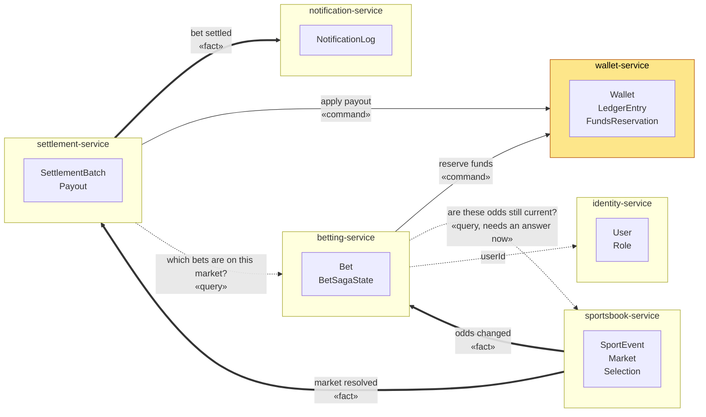

# BetFlow — context map

The six bounded contexts, the entities each one owns, and who needs to talk to whom.

Interactions are classified by **what they are**, not by the technology that will carry them.
That choice comes later, with its own ADR: naming a broker here would be deciding it by drawing
rather than by reasoning.

## Legend

| Line | Kind | Meaning |
|---|---|---|
| thick `==>` | **fact** | Something happened. The sender does not know or care who listens, and does not wait. Adding a new listener must not require changing the sender. |
| solid `-->` | **command** | An order aimed at one specific recipient. The sender expects it to be carried out, and cares whether it was. It can be resolved later — the sender does not have to block. |
| dotted `-.->` | **query** | The sender needs an answer to continue. Only one of these blocks: Betting asking Sportsbook whether the odds are still current, because a bet cannot be accepted on stale odds. |

**Wallet is highlighted** because it is the only context with writing authority over money. No
arrow enters it as a direct read or write — they are all requests it decides whether to serve.

**There is no arrow between databases.** The day one appears, the boundary is broken.

## What is deliberately left open

- The transport for facts and commands. Facts and commands have different delivery needs
  (broadcast and replay vs. point-to-point with retries), so they will probably not share one
  mechanism — but that is a decision to argue, not to assume.
- How Settlement gets the bets for a market: a query to Betting, or its own copy built from the
  facts Betting publishes. Both are defensible; it depends on how much staleness settlement can
  tolerate.
- Whether Betting needs Identity at all at request time, or whether a `userId` carried in the
  request is enough.

These get resolved — and written down — as the flows that need them are built.
