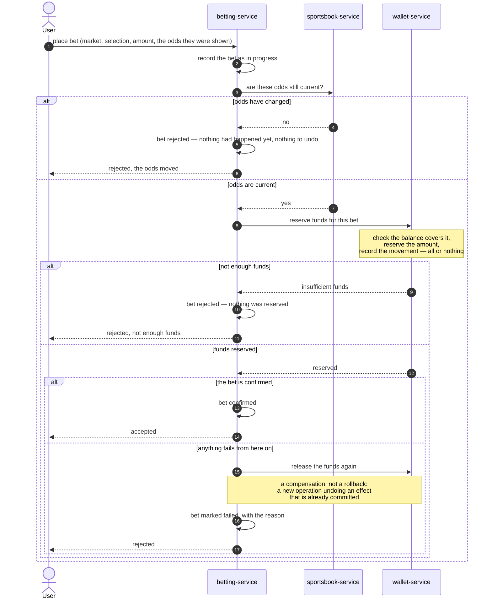

# BetFlow — use cases

The business flows the platform has to support, and how they cross context boundaries.

As in the [context map](context-map.md), interactions are described by what they are — a fact, a
command, a query — not by the technology that will carry them.

## The four flows

| Use case | Crosses | Notes |
|---|---|---|
| **Place a bet** | Betting → Sportsbook, Betting → Wallet | The only flow that needs coordinated steps and a rollback story. Detailed below. |
| **Top up funds** | Wallet only | Entirely inside one context: add balance, write a ledger entry, same transaction. No boundary crossed. |
| **Settle a market** | Sportsbook → Settlement → Wallet → Notification | Triggered by one rare fact with a massive effect: thousands of bets at once. |
| **Watch live odds** | Sportsbook → user | Read-only and very high frequency. Never touches the betting or money path. |

Only "place a bet" is worked out in detail here. The others get their own section as they are
built — a diagram of a flow that does not exist yet is a guess, not documentation.

## Place a bet

The interesting part is not the happy path, it is that **step 2 has a visible effect that step 3
can no longer undo with a database rollback**. Once funds are reserved, the only way back is a
new business operation that releases them.

## Why this flow needs coordination and the others do not

- It spans two contexts that each commit their own work independently. There is no single
  transaction covering "odds are valid" plus "funds are reserved" plus "bet is confirmed".
- Every step before the last one can succeed and still end up needing to be undone.
- Somebody has to know which step a bet is on. That is what `BetSagaState` is for, and it is why
  it is stored rather than held in memory: the answer to "reserve funds" may come back long
  after the original request, possibly to a different instance of the service.

## Open questions this flow raises

- **How does Betting learn the result of the reservation?** Drawn here as a straight reply, but
  if the reservation is not resolved immediately, the reply has to find its way back to whichever
  instance picks it up.
- **What counts as a retry, and what counts as a failure?** "Not enough funds" is a business
  answer and is final. "Wallet did not respond" is a technical failure and might just need
  another attempt. Collapsing both into one error path is the easy mistake here.
- **What if the release itself fails?** The compensation needs to be safe to run more than once.
